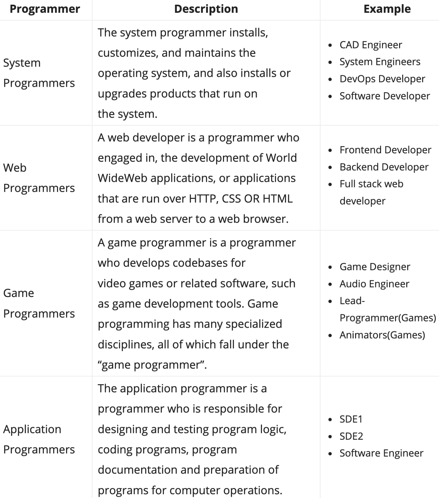

I am Linda, a Frontend Developer at BuyCoins, you can call me Linda too.
Before getting into programming, I thought it was magic, something you couldn’t just learn. I assumed you had to be extraordinarily smart to speak the ‘language of computers’. Don’t worry if you feel that way.

I studied Biomedical Engineering and graduated in 2017. I spent my service year working at a Federal Medical Centre as a biomedical engineer. During that time, I decided to explore my various interests, one of which is programming.

Six months after rounding up my service, I started my first day as a frontend developer intern at Buycoins in June 2019. I was very excited, it felt surreal. I realized instantly that I had not been learning how to code in the most effective way.

This post aims to guide you as you start your programming journey.

<h3>Choose a specific career path</h3>

You want to be a programmer? Good! But that’s a little vague. The first thing you should do is get a sense of what type of programming interests you. You don’t have to lock strictly on it but it helps with navigating the waters and knowing where to start learning from.

The table below gives a brief description of the popular types of programmers.

    <table class="tg">
    <thead>
    <tr>
        <th class="tg-0pky">Programmer</th>
        <th class="tg-0pky">Description</th>
        <th class="tg-0pky">Example</th>
    </tr>
    </thead>
    <tbody>
    <tr>
        <td class="tg-0pky">System Programmer</td>
        <td class="tg-0pky">The system programmer installs,
                            customizes, and maintains the
                            operating system, and also installs or
                            upgrades products that run on
                            the system.</td>
        <td class="tg-0pky">• CAD Engineer   • System Engineers  • DevOps Developer • Software Developer</td>
    </tr>
    <tr>
        <td class="tg-0pky">Web Programmers</td>
        <td class="tg-0pky">A web developer is a programmer who
                            engaged in, the development of World
                            WideWeb applications, or applications
                            that are run over HTTP, CSS OR HTML
                            from a web server to a web browser.</td>
        <td class="tg-0pky">• Software Developer  • Frontend Developer  • Backend Developer  • Full stack web</td>
    </tr>
    <tr>
        <td class="tg-0pky">Game Programmers</td>
        <td class="tg-0pky">A game programmer is a programmer
                            who develops codebases for
                            video games or related software, such
                            as game development tools. Game
                            programming has many specialized
                            disciplines, all of which fall under the
                            "game programmer".</td>
        <td class="tg-0pky">• Game Designer  • Audio Engineer  • Lead-Programmer(Games)  • Animators(Games)</td>
    </tr>
        <tr>
        <td class="tg-0pky">Application Programmers</td>
        <td class="tg-0pky">The application programmer is a
                            programmer who is responsible for
                            designing and testing program logic,
                            coding programs, program
                            documentation and preparation of
                            programs for computer operations.</td>
        <td class="tg-0pky">• Software Development Engineer-1  • Software Development Engineer-2</td>
    </tr>
    </tbody>
</table>

<!--  -->

The most popular programmers are web programmers (Frontend and Backend). Most newbies think they have to be one or the other. I suggest you research the various careers in programming and make a decision on what you want to explore.

_Remember, not all roles in tech involve core programming. Click this to check out other roles._

<h3>Have a clear learning path</h3>

After finding a career path you are interested in, you should research on the skills required for that career and the order in which to learn those skills. A typical career path for a frontend developer starts with version control, followed by HTML and CSS, then Javascript which is a programming language and finally a frontend framework.

Don’t fuss about what programming language to learn from the start. One common mistake for beginners is learning a programming language first. They start off learning without context or understanding of its real-world application. Programming languages rarely stand alone. So make sure you learn in the right order.

<h3>Find a good learning platform</h3>

There are many paid and free resources out there that can walk you through this steep journey, but first, do yourself a favor of figuring out your preferred mode of learning.

Do you comprehend concepts better when you read? Then try Codecademy or freeCodeCamp. Are you better with explanatory videos? check out courses on platforms like Udacity and Udemy. You don’t have to learn strictly by one of the methods mentioned above, just figure out what works for you.

Here is a link to check out for top programming learning platforms.

<h3>Keep Coding!</h3>

Learning a new skill isn’t easy and I am so proud of you for making this decision. The first few months could be confusing but keep at it and things will get clearer.

One of the best ways to learn fast is by building — work on projects as you grow. You should also surround yourself with the right content to keep you motivated. Participate in coding challenges, follow programmers who you admire and don’t be too hard on yourself.

Lastly, I wanna say a big thank you to the founders of BuyCoins — Timi Ajiboye, Ire Aderinokun, and Aleph Pi for giving me this rare opportunity. Thank you for making my year.

Song Recommendation: Be still by Hillsong. https://open.spotify.com/track/6OIzniRIlDqO4DQ6Way8P3 https://music.apple.com/ng/album/be-still/1347074675?i=1347075193

If you have any questions or suggestions feel free to leave a response or reach me at @LindaOjo
