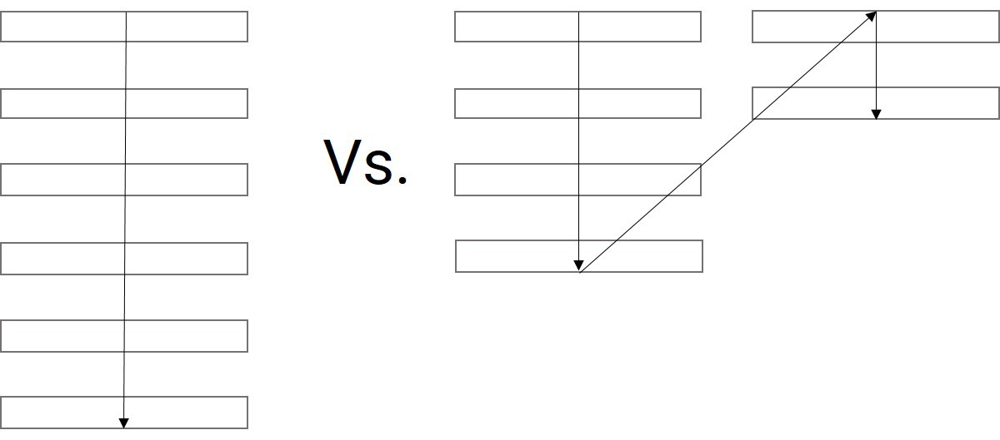
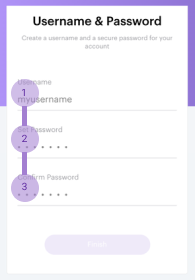
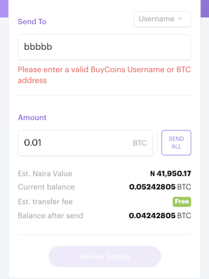
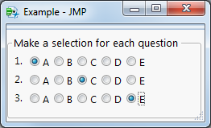
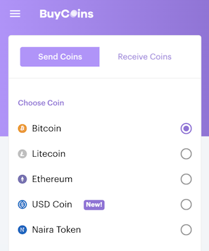
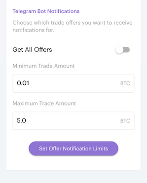
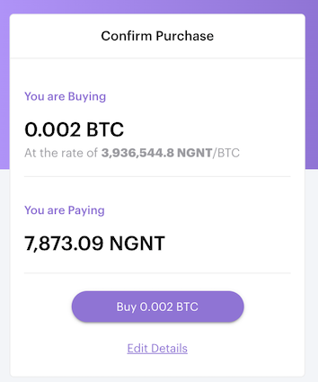

Forms are a common way to engage with users and could be a user’s first impression of your product. Since forms aren’t always the user’s favourite thing, it is essential to make filling out forms as easy as possible. Let’s go over a few tips for creating great forms.

<h3>Use a Single Column Layout</h3>

Limiting your form to one column makes it easier for users to read and lets you predict the order in which the form should be filled. A single column form also favours keyboard users by making it simple to tab from one field to another. If you have a long form, consider grouping related fields and placing them in different sections.

<h3>Top Align Labels</h3>

Top-aligned labels tend to reduce how long it takes to complete a form. Especially for familiar data (i.e. phone number, credit card etc.) because they only require a single eye fixation to take in both input label & field. Top aligned labels also work well with single column forms.

<h3>Use Descriptive Inline Errors</h3>

Simply changing the appearance of a field with an invalid input is not enough to let the user know exactly what they are not doing right and this can be frustrating. This is why adding a clear error directly under the invalid field is good practice. With this method, the user would know where and why the error occurred.

<h3>Vertically Arrange Radio buttons and Checkboxes</h3>

Horizontally arranged radio buttons, as shown above, should be avoided. The labels and buttons are placed on one line, even though this may seem great for maximising space, it creates an error-prone condition for the user.

The recommended practice is to place each option on its own line as done above. This greatly reduces the chance of a user picking an unintended option. Plus, placing buttons/boxes underneath each other improves readability.

<h3>Make Call-to-Actions Descriptive</h3>

The call-to-action (CTA) in the form above is the purple button. CTAs are obvious and should state their intent so the user is aware of the effects of interacting with the CTA in question.

<h3>Differentiate Primary and Secondary Actions</h3>

The <strong>primary action</strong> (Purple button) allows the user to accomplish their most common or most important goal. <strong>Secondary actions</strong> (Hyperlink text) are any less important actions. Primary actions should always stand out and come first (top or left). This reduces the likelihood a user will make the wrong choice.

<h3>Disable buttons while a triggered process runs</h3>

To stop users from clicking the same button twice within a short period, buttons should be disabled while the triggered process runs. This is a minor change but it will save you a lot of headaches especially in situations where users submit data.

That’s it, folks! 🐰 With the tips above you can take your forms to the next level. Remember, building great forms is not an event, it’s a continuous process because the needs and preferences of users constantly change.