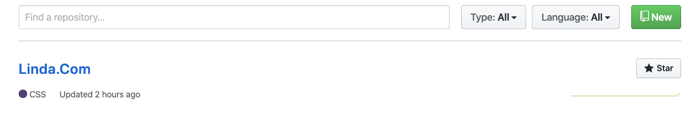
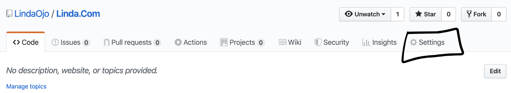
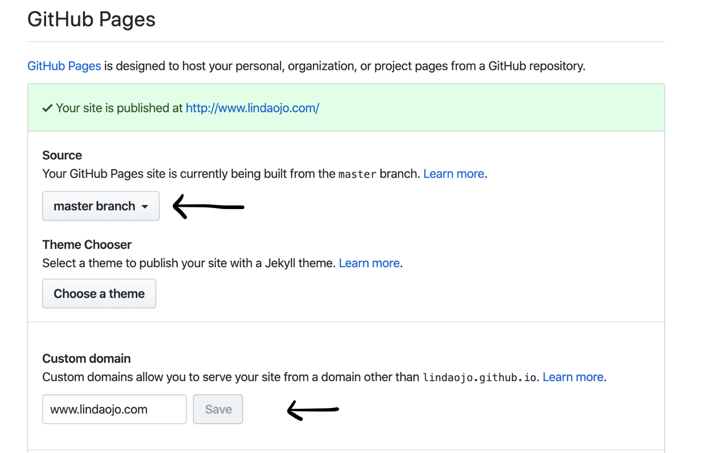
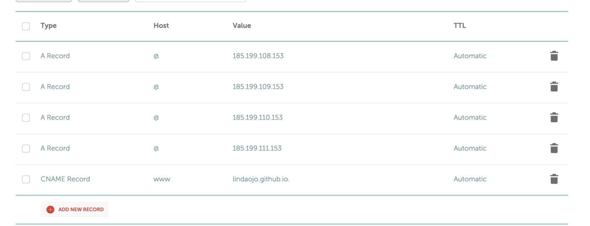

Not too long after becoming a developer, an urge comes upon you to create a personal website. you can only resist for so long. I gave in two days ago and I am happy to say you can check out my personal website at
<a class="pink-link" href="https://lindaojo.com">www.lindaojo.com</a>

After creating my simple personal website, I had to host it so I could connect my domain name, here is how I did that.

<h3>Create a Repository on Github</h3>

Create a <strong>public</strong> repository for your website and name it what you want. My repository looks like the image below. Make sure your master branch is up to date with all your files and renders your desired website.

<h3>Change source of Github page</h3>

Open your repository and click on settings

The scroll down to <strong>Github Pages</strong> and change source to Master Branch and then put in the custom domain you have purchased. If you don’t have one, you can get at NameCheap or any other domain seller.

A <strong>CNAME</strong> file will be automatically added to your project as seen below.

<h3>Manage your Domain</h3>

If you are on NameCheap, navigate to the Domain list and click on Manage for the corresponding domain.
Under <strong>Advanced DNS</strong> (Domain Name System), replicate the list of records below. Make sure to use
<strong>[yourusername].github.io</strong> in the CNAME record.

That's it! You have connected your domain name to your website. It should take at most 30 minutes for this to work. check out your website using your new domain name and smile.
