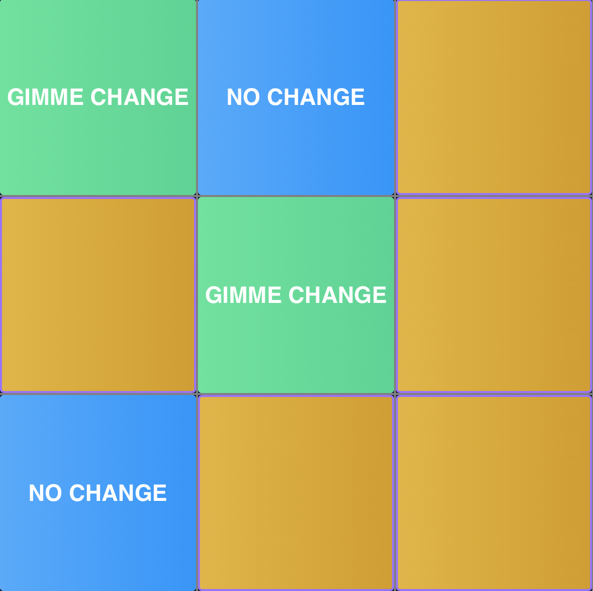

In my last post– <a class=pink-link href="/blog/how-to-start-your-programming-journey/">How to Start your Programming Journey</a>, I mentioned working on personal projects to help build your programming skills. I decided to give you a nudge by going ahead to work on a new personal project myself.

This post gives you a preview of an App I worked on using the guide of a <a class=pink-link href="https://www.youtube.com/watch?v=G0bBLvWXBvc">Firebase tutorial</a>.

A popular beginner-friendly project is “Tic-Tac-Toe”. I have built Tic-Tac-Toe before using plain Javascript. This time I am working with the Angular framework and Nebular.

I played around with the styles and gave my App a Lagos-touch. I deployed this using <a class="pink-link" href="https://bit.ly/3bHRfVF">Firebase</a> and you can
<a class="pink-link" href="https://myapp-3943c.firebaseapp.com">play it now!</a> 

Announcement!: <a href="https://buycoins.africa">BuyCoins Africa</a> just launched a <a class="pink-link" href="https://ngnt.org">Naira backed stablecoin</a>.
